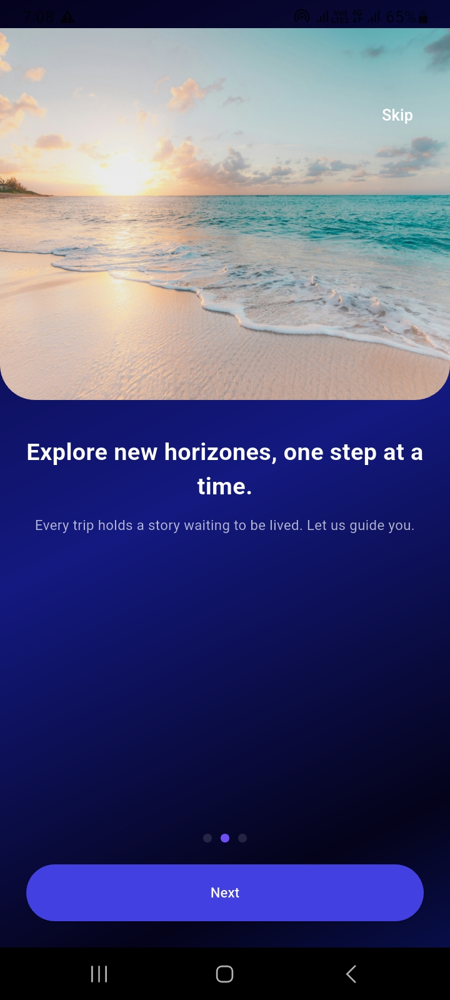
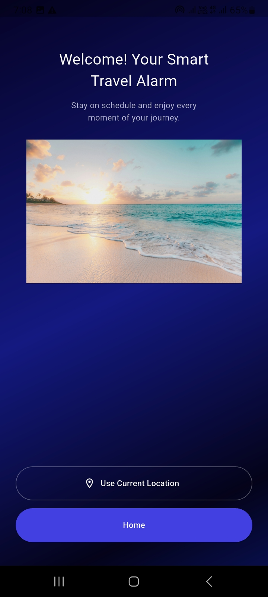
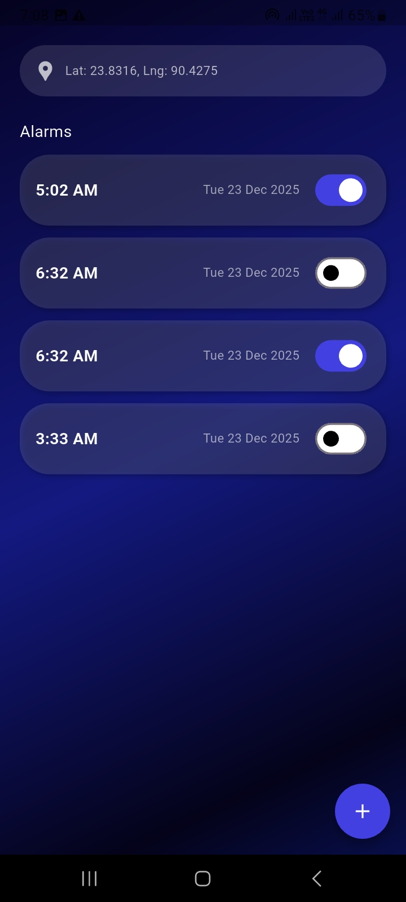
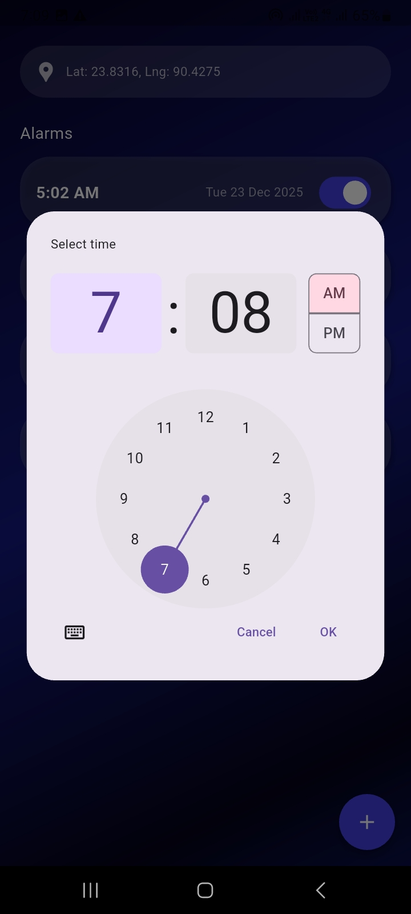

# ⏰ Flutter Alarm App with Onboarding

A Flutter application built as part of a technical assessment.  
The app guides users through a 3-step onboarding flow, requests location access, and allows users to create and manage alarms with local notifications.

---

## 🚀 Features

- 3-step onboarding experience
- Skip & Next navigation
- Location permission screen
- Alarm creation with time picker
- Local notification scheduling
- Persistent alarm storage using SharedPreferences
- Clean and modular project structure
- State management using Provider

---

## 📱 Screens

- Onboarding Screen  
- Location Permission Screen  
- Home (Alarm) Screen  

---

## 🛠️ Tools & Packages Used

- **Flutter SDK**
- **provider** – state management
- **shared_preferences** – local storage
- **smooth_page_indicator** – onboarding indicator
- **google_fonts** – custom fonts
- **flutter_local_notifications** – alarm notifications

---

## ▶️ Demo Video

Loom video showing the app running on an emulator:

🔗 **https://www.loom.com/share/9c8a223fd96c4a22b16b6085b1995546**

---

## 🖼️ Screenshots

Screenshots are located in the `screenshots/` folder.

| Onboarding | Location | Home |
|-----------|----------|------|
|  |  |  | 

---

## ⚙️ Project Setup 

```bash
flutter pub get
flutter run
